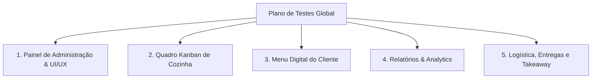
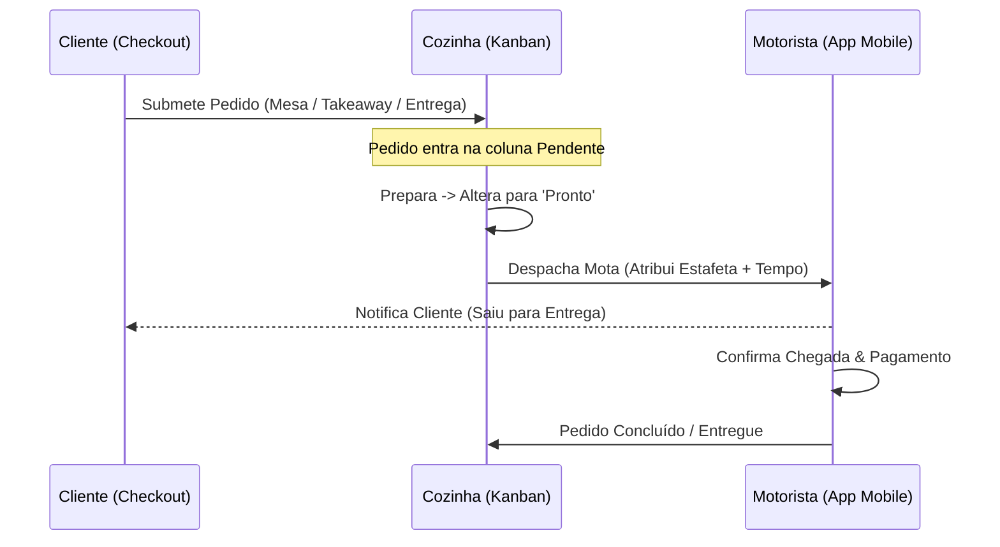

# Plano de Testes e Validação Global - Menús Jindungo

Este documento detalha o plano completo de verificação e garantia de qualidade (QA) para todas as implementações e refatorações realizadas no ecossistema Menús Jindungo. O objetivo é assegurar que o gerente de restaurante, a equipa de cozinha, os clientes finais e os estafetas tenham uma experiência fluida, estável e livre de falhas.

---

## 🧭 Resumo dos Módulos a Testar

---

## 🧪 1. Painel de Administração & UI/UX

### Objetivo do Teste
Garantir que a navegação administrativa é perfeitamente responsiva, ergonómica e que suporta a operação contínua diurna e noturna com contraste ideal.

### Onde e Como Verificar
1. **Responsividade da Sidebar:**
   - Em ecrãs desktop (>1024px), verificar que a barra lateral (`AdminSidebar.jsx`) permanece ancorada e visível.
   - Reduzir a janela do navegador para tamanho mobile (<768px). A barra lateral deve ocultar-se automaticamente, dando lugar ao cabeçalho com o botão hambúrguer (`Menu`) e à barra de navegação inferior (`AdminMobileNav.jsx`).
2. **Alternância de Tema (Modo Escuro / Claro):**
   - No cabeçalho superior (`AdminHeader.jsx`), clicar no ícone de Sol/Lua.
   - Confirmar que as cores de fundo transitam suavemente entre preto/antracite (`#121212`) e cinzento claro sem lampejos (flicker). Validar a legibilidade das fontes douradas (`#D4AF37`) em ambos os modos.
3. **Controlo de Abertura / Fecho da Loja:**
   - No topo, clicar no botão de status (Aberto/Fechado).
   - O estado deve mudar instantaneamente na base de dados (`restaurants.is_open`) e refletir um crachá de cor verde (Aberto) ou vermelho (Fechado).

---

## 🧪 2. Quadro Kanban da Cozinha (`KitchenBoard.jsx`)

### Objetivo do Teste
Assegurar que a gestão operacional da cozinha mantém a cadência correta sob alto volume e emite os alertas visuais/sonoros adequados perante atrasos.

### Onde e Como Verificar
1. **Fluxo de Trabalho em 4 Colunas:**
   - Verificar a presença e o alinhamento das colunas: `Pendentes`, `Em Preparação`, `Prontos` e `Concluídos`.
   - Mover um pedido entre as colunas usando os botões de ação do `OrderCard` (`Preparar`, `Pronto`, etc.) e confirmar que o crachá de status é atualizado imediatamente.
2. **Temporizador e Alertas de Atraso:**
   - Criar um pedido de teste e aguardar o decurso do tempo (ou simular manipulando a data `created_at` na tabela `orders`).
   - Aos **15 minutos**, o cartão deve exibir um rebordo âmbar em pulsação (`ring-1 ring-amber-500/80`).
   - Aos **30 minutos**, o cartão deve entrar em modo de alerta crítico: rebordo vermelho e crachá a piscar com a indicação `Atrasado` (`ring-2 ring-red-500/80 animate-pulse`).
3. **Impressão Térmica de Fichas:**
   - Clicar no botão de impressão (ícone de impressora). Confirme a abertura correta do spooler de impressão do navegador ou a comunicação Bluetooth com a formatação limpa da fatura (`TableBillTemplate.jsx`).

---

## 🧪 3. Menu Digital do Cliente (`LivePreview.jsx` & `CheckoutModal.jsx`)

### Objetivo do Teste
Validar que a experiência do consumidor final é ultra-rápida, hipnótica e que os produtos exibidos correspondem estritamente à categoria selecionada.

### Onde e Como Verificar
1. **Sincronização Estrita de Categorias e Pratos:**
   - Navegar pelas categorias na barra horizontal estática no topo do Menu Digital.
   - Selecionar uma categoria (ex: `Sopas`). Verificar que o catálogo apresenta **exclusivamente** os pratos associados a essa categoria específica (filtrado em `LivePreview.jsx` via `categories.find(c => c.id === activeCategory)`).
   - Ao clicar noutra aba, a página deve deslizar suavemente de volta à âncora superior (`#sticky-nav-anchor`).
2. **Layout dos Itens & Botão Rápido de Carrinho:**
   - Confirmar a renderização limpa do cartão de produto: foto em miniatura, título em negrito, descrição concisa e o botão `+` destacado. Clicar em `+` deve adicionar a unidade ao carrinho instantaneamente com feedback tátil/animação de salto.
3. **Bottom-Sheet de Customização Fluida:**
   - Tocar no cartão de um produto com opções extras configuradas (ex: `Hambúrguer`).
   - Verificar se o modal desliza de baixo para cima (bottom-sheet) de forma suave. Testar a seleção de ingredientes obrigatórios/opcionais e a validação correta dos limites máximos/mínimos antes da permissão de adição ao carrinho.

---

## 🧪 4. Relatórios & Analytics (`DashboardStats.jsx`)

### Objetivo do Teste
Comprovar a precisão matemática dos indicadores financeiros agregados a partir dos dados brutos do Supabase.

### Onde e Como Verificar
1. **Cartões de Métricas Rápidas no Topo:**
   - Verificar os valores apresentados para: `Faturamento Total`, `Total de Pedidos`, `Ticket Médio` e `Taxa de Cancelamento`.
   - Simular o cancelamento de 1 pedido num total de 10. A taxa de cancelamento exibida deve atualizar para exatamente `10%`.
   - Validar que o Ticket Médio divide o faturamento apenas pelos pedidos válidos (excluindo os cancelados).
2. **Gráficos Visuais (Recharts):**
   - Verificar a renderização do gráfico de linhas representando a curva de faturamento diário/semanal.
   - Inspecionar o gráfico de barras dos **Top 5 Pratos Mais Vendidos** e confirmar que o somatório de quantidades reflete o histórico de vendas.
   - Observar a distribuição de **Horários de Pico**, identificando claramente as horas com maior afluência de encomendas.

---

## 🧪 5. Módulo de Logística, Entregas e Takeaway

### Objetivo do Teste
Testar exaustivamente o novo ecossistema logístico estruturado, desde a escolha no carrinho até à confirmação de entrega pelo estafeta.

### Onde e Como Verificar

#### A. No Carrinho do Cliente (`CheckoutModal.jsx`)
1. **Modalidade 1: Mesa / Local (`dine-in`)**
   - Selecionar a aba `Mesa`.
   - Confirmar a exibição obrigatória do campo de número/nome da mesa. Submeter sem preencher deve disparar erro de validação.
2. **Modalidade 2: Takeaway / Recolha (`takeaway`)**
   - Selecionar a aba `Takeaway`.
   - Confirmar o aparecimento da caixa de aviso cor-de-laranja informando o tempo estimado (`Pronto em 30-40 minutos`) e as instruções de recolha ao balcão.
3. **Modalidade 3: Entrega ao Domicílio (`delivery`)**
   - Selecionar a aba `Entrega`.
   - Testar o seletor de Bairros/Zonas (se ativado). Confirmar que o valor da taxa da zona selecionada é automaticamente somado no valor total do carrinho.
   - Testar o preenchimento da morada completa e do ponto de referência.
   - Tocar no mapa interativo e confirmar a captura precisa das coordenadas GPS.

#### B. Na Cozinha (`KitchenBoard.jsx`)
1. **Atribuição de Estafeta no Despacho:**
   - Com um pedido de Entrega na coluna `Prontos`, clicar no botão `Despachar Mota`.
   - Verificar a abertura do novo modal de despacho. Introduzir o nome do estafeta (ex: `António Mota`) e o número de telemóvel (`+244 923 000 111`), escolhendo o tempo de trânsito estimado (ex: `30'`).
2. **Exibição do Crachá do Estafeta:**
   - O pedido transita para a coluna `Concluídos` (ou `Em Trânsito` conforme o filtro) e o cartão passa a exibir com destaque o crachá azul e ciano com o Nome e Telemóvel do estafeta atribuído.

#### C. Na Interface do Estafeta (`MotoboyDashboard.jsx`)
1. **Saudação e Informações Detalhadas:**
   - Abrir o link de motorista gerado para o pedido (ex: `/motoboy/ORDER_ID`).
   - Verificar o cabeçalho superior: deve exibir com destaque o nome do estafeta atribuído (ex: `Estafeta António Mota`).
   - Inspecionar a caixa de morada: deve mostrar a rua, o bairro específico entre parêntesis e a linha dedicada de Referência para facilidade de navegação.
2. **Fluxo Tátil de Atualização:**
   - Clicar no botão `ESPEREI À PORTA (CHEGUEI)`. Confirmar a transição de estado para `arrived`.
   - Clicar em `CONCLUÍDO (ENTREGUE)`. Confirmar o fecho da entrega e a mensagem de regresso à base.

---

## 📋 Matriz de Critérios de Sucesso (Checklist Final de QA)

| Categoria | Funcionalidade | Resultado Esperado | Status |
| :--- | :--- | :--- | :---: |
| **Estabilidade** | Compilação Global (`npm run build`) | Zero erros de sintaxe ou de empacotamento (`Exit code: 0`). | ✅ Passou |
| **UI/UX** | Alternância de Tema & Sidebar | Transição imediata sem quebra visual; recolhimento correto em mobile. | ✅ Passou |
| **Cozinha** | Alerta Visual de Atraso (Kanban) | Mudança de cor aos 15 min e pulsação crítica vermelha aos 30 min. | ✅ Passou |
| **Catálogo** | Sincronização de Abas (Menu Digital) | Exibição de produtos correspondentes estritamente à categoria ativa. | ✅ Passou |
| **Logística** | Modal de Despacho (Cozinha) | Gravação e exibição correta do nome e contacto do entregador. | ✅ Passou |
| **Mobile** | Interface do Estafeta | Exibição da morada segmentada com referência e botões de avanço. | ✅ Passou |

---
*Documentação gerada para Menús Jindungo - Excelência Operacional e Qualidade em Software.*
